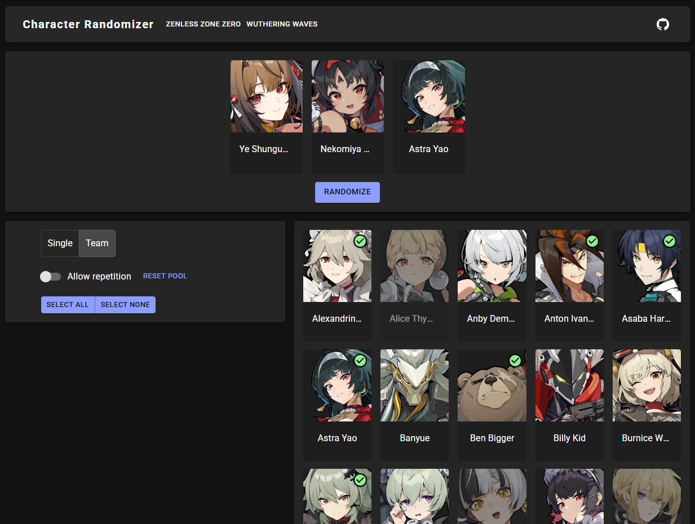

# Character Randomizer

  

A web tool for randomizing game characters.  
This project was created for learning and fun purposes.  
Game and character information is taken from [Fandom Wiki pages](https://www.fandom.com).  
Inspired by [Genshin Impact Team Randomizer by Pustur](https://github.com/Pustur/genshin-impact-team-randomizer).

## Features

- Randomize a single character or a party
- Select which characters you own (which characters to include in the pool)
- Control repetition mode
  - Allow repetition off: removes the character from the pool after it's selected. The pool is reset after all characters have been selected
  - Allow repetition on: randomized characters are kept in the pool
- Owned characters are saved in the browser local storage, so the pool will be kept on subsequent page visits

## Supported games

- [Zenless Zone Zero](https://zenless-zone-zero.fandom.com/wiki/Agent/List)
- [Wuthering Waves](https://wutheringwaves.fandom.com/wiki/Resonator/List)

## Technology

- Javascript
- React
- Vite
- MUI

## References

- [Genshin Impact Team Randomizer by Pustur](https://github.com/Pustur/genshin-impact-team-randomizer)
- [Using localStorage with React Hooks](https://blog.logrocket.com/using-localstorage-react-hooks/)
- [Material UI docs](https://mui.com/material-ui/getting-started/)
- [MUI Theme Creator](https://zenoo.github.io/mui-theme-creator/)
- [Fisher–Yates shuffle algorithm](https://en.wikipedia.org/wiki/Fisher–Yates_shuffle)